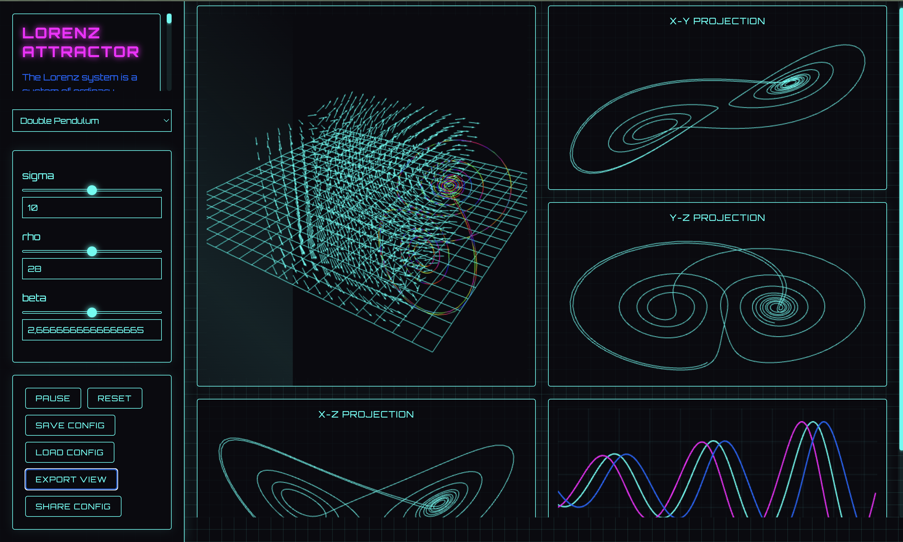

# Dynamical Systems Simulator

An interactive, educational simulator for exploring various dynamical systems with real-time visualization and parameter control. Built with Three.js and featuring a cyberpunk-themed UI.



## Features

### Supported Systems
- **Lorenz Attractor**: The classic chaotic system showing butterfly-like trajectories
- **Double Pendulum**: A physical system demonstrating chaos in mechanical motion
- **Rössler Attractor**: Another chaotic system with scroll-like trajectories
- **Van der Pol Oscillator**: A non-linear oscillator with limit cycle behavior
- **Point Attractor**: Demonstrates convergent behavior
- **Point Repeller**: Shows divergent dynamics

### Visualization Features
- Real-time 3D visualization with WebGL
- Interactive camera controls (rotate, zoom, pan)
- 2D projections (X-Y, Y-Z, X-Z planes)
- Time series plots for all variables
- Color-coded trajectories based on velocity
- Vector field visualization
- Smooth 60 FPS performance

### Interactive Controls
- Real-time parameter adjustment via sliders
- Play/Pause/Reset controls
- System selection dropdown
- Save/Load configuration options
- Export visualization as PNG
- Share configurations via URL

### Educational Components
- Mathematical equations and explanations
- Parameter effects visualization
- System stability analysis
- Real-time trajectory analysis

### Technical Features
- Responsive design
- Touch interface support
- WebGL-based rendering
- Modular architecture
- High-performance simulation engine

## Getting Started

1. Clone the repository:
```bash
git clone https://github.com/yourusername/dynamical-systems-sim.git
cd dynamical-systems-sim
```

2. Start a local server:
```bash
# Using Python 3
python3 -m http.server 3000

# Or using Node.js
npx serve -p 3000
```

3. Open in your browser:
```
http://localhost:3000
```

## Usage

### Basic Controls
- **Rotate View**: Click and drag
- **Zoom**: Mouse wheel or pinch gesture
- **Pan**: Right-click and drag
- **Reset View**: Double-click

### Parameter Adjustment
1. Select a system from the dropdown menu
2. Use the sliders to adjust parameters in real-time
3. Observe the effects on the system's behavior

### Saving/Loading
- Click "Save Config" to download the current configuration
- Use "Load Config" to restore a saved state
- Share configurations using the "Share Config" button

### Visualization Export
- Click "Export View" to save the current visualization as a PNG image
- The exported image includes all views (3D, projections, and time series)

## Technical Details

### Architecture
- Three.js for 3D visualization
- Custom numerical integrators for each system
- WebGL for hardware-accelerated graphics
- HTML5 Canvas for 2D projections and time series

### Performance Optimizations
- Efficient trajectory management
- GPU-accelerated rendering
- Adaptive time stepping
- Memory-efficient data structures

## Contributing

1. Fork the repository
2. Create your feature branch (`git checkout -b feature/AmazingFeature`)
3. Commit your changes (`git commit -m 'Add some AmazingFeature'`)
4. Push to the branch (`git push origin feature/AmazingFeature`)
5. Open a Pull Request

## License

This project is licensed under the MIT License - see the [LICENSE](LICENSE) file for details.

## Acknowledgments

- Three.js for 3D visualization
- The dynamical systems research community
- Contributors and testers

## Contact

Sayhan Yalvaçer
Project Link: [https://github.com/sayhany/dynamical-systems-sim](https://github.com/sayhany/dynamical-systems-sim)
